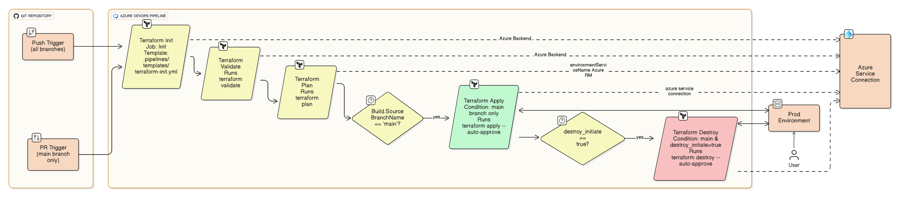
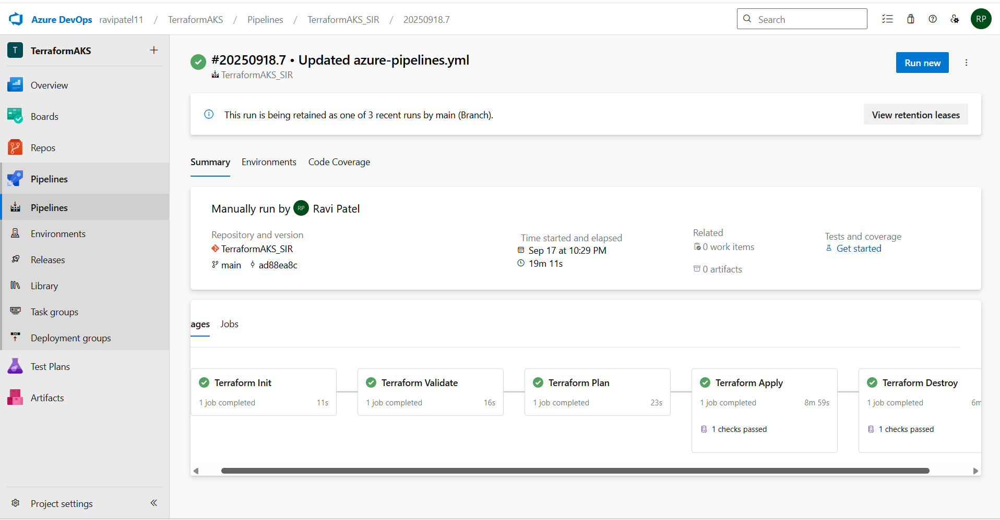

# Terraform AKS Deployment with Azure DevOps CI/CD  

## Project Overview  
This project demonstrates how I automated the deployment of an **Azure Kubernetes Service (AKS) cluster** using **Terraform** integrated with **Azure DevOps Pipelines**.  

The focus is on showcasing **Infrastructure as Code (IaC)** and **CI/CD automation** skills rather than the actual Terraform configuration. The Terraform code is kept private — this repository highlights the workflow, architecture, and results.  

---

## Objectives  
- Showcase **cloud infrastructure automation** using Terraform.  
- Build a **CI/CD pipeline in Azure DevOps** to run Terraform stages.  
- Follow best practices by separating concerns (pipeline templates, configs, outputs).  
- Present the project as a professional **portfolio case study**.  

---

## Tools & Technologies  
| Tool / Service | Purpose |
|----------------|---------|
| **Terraform** | Infrastructure as Code (IaC) |
| **Azure DevOps Pipelines** | CI/CD automation |
| **Azure Kubernetes Service (AKS)** | Container orchestration |
| **YAML Pipelines** | Workflow definition |
| **Azure Resource Manager (ARM)** | Backend resource management |

---

## Pipeline Workflow  
The pipeline automates the full Terraform lifecycle inside Azure DevOps:  

1. **Terraform Init** → Initializes providers and backend.  
2. **Terraform Validate** → Ensures code syntax is correct.  
3. **Terraform Plan** → Previews infrastructure changes.  
4. **Terraform Apply** → Provisions AKS cluster and related resources.  
5. **Terraform Destroy** → Cleans up resources when no longer needed.  

---

## Screenshots  

### Architecture Diagram  
  

### Pipeline Execution  
    

---

## Key Outcomes  
- Automated provisioning of AKS with repeatable Terraform templates.  
- CI/CD pipeline integrated directly into Azure DevOps.  
- Clear separation of environments using variables and backend config.  
- Visual proof of successful pipeline execution and architecture.  

---

## What I Learned  
- How to integrate **Terraform workflows with Azure DevOps**.  
- Managing infrastructure lifecycle via pipelines (init → apply → destroy).  
- Writing **clean, reusable YAML templates** for pipelines.  
- Best practices for keeping sensitive data (tfvars, backend) private.  
 
